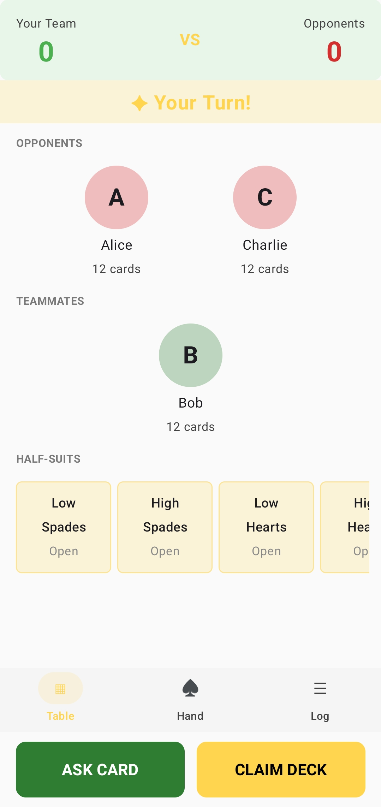
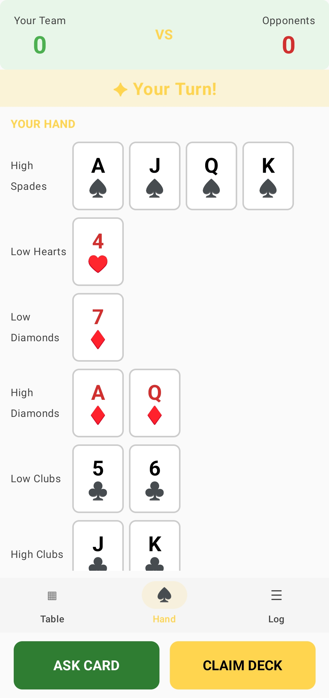
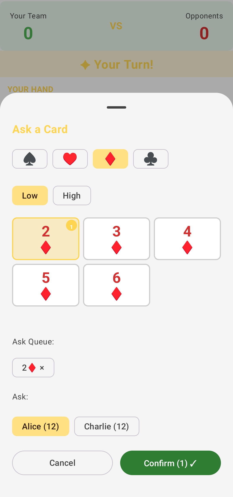

# Literature — Card Game

A fully playable **Literature** card game built with Kotlin Multiplatform + Compose Multiplatform. Play offline against bots or go head-to-head with friends in real-time multiplayer — on Android and iOS from a single codebase.

---

## What is Literature?

Literature is a strategic team card game played with a 48-card deck (standard 52-card deck with all four 8s removed). Cards are split into 8 **half-suits** of 6 cards each:

| Half-Suit | Cards |
|-----------|-------|
| ♠ Lower | 2♠ 3♠ 4♠ 5♠ 6♠ 7♠ |
| ♠ Upper | 9♠ 10♠ J♠ Q♠ K♠ A♠ |
| ♥ Lower | 2♥ 3♥ 4♥ 5♥ 6♥ 7♥ |
| ♥ Upper | 9♥ 10♥ J♥ Q♥ K♥ A♥ |
| ♦ Lower | 2♦ 3♦ 4♦ 5♦ 6♦ 7♦ |
| ♦ Upper | 9♦ 10♦ J♦ Q♦ K♦ A♦ |
| ♣ Lower | 2♣ 3♣ 4♣ 5♣ 6♣ 7♣ |
| ♣ Upper | 9♣ 10♣ J♣ Q♣ K♣ A♣ |

Teams compete to **claim half-suits** by correctly declaring which player holds each of the 6 cards in that suit.

### How to Play

1. **Ask** an opponent for a card — you must already hold one from the same half-suit
2. If they have it, the card transfers to you and **you keep your turn**
3. If they don't, the **turn passes to them**
4. **Claim** a half-suit on your turn by declaring the exact location of all 6 cards across your team
5. Correct claim → **+1 point** for your team. Wrong claim → **+1 point** for opponents
6. First team to win **5 of 8 half-suits** wins (4–4 is a draw)

---

## Features

### Offline
- Play solo against bots in **4, 6, or 8-player** modes
- Bot AI tracks the game log to infer card locations and makes intelligent ask/claim decisions
- Full rules enforcement — move validation, turn management, card tracking, player elimination

### Multiplayer
- Create or join a room with a **6-character room code**
- Real-time gameplay over **WebSockets** — each player sees only their own hand
- Bot fill-ins for empty seats so games can start with any number of players
- Automatic disconnect handling and reconnect support

### UI & Experience
- **Animated onboarding** — 5-page interactive walkthrough shown once on first install
- **Light & dark theme** with full system theme support across all screens
- Multi-step ask and claim flows with confirmation
- **Deck tracker** — 8 tiles showing unclaimed, your team, and opponent half-suits at a glance
- **Game log** — collapsible live event feed with colour coding

---

<p align="center">



</p>

## Tech Stack

| Concern | Technology |
|---------|-----------|
| UI | Compose Multiplatform 1.10.0 |
| Language | Kotlin 2.3.0 |
| Shared Logic | Kotlin Multiplatform |
| Networking | Ktor 3.1.3 (WebSocket client + server) |
| DI | Koin 4.1.0 |
| Navigation | AndroidX Navigation Compose 2.9.2 |
| Serialization | kotlinx.serialization 1.8.1 |
| Async | Kotlin Coroutines 1.10.2 + Flow |
| Min SDK | 24 (Android 7.0) |
| Target SDK | 36 |

---

## Architecture

```
Literature/
  shared/        # KMP library — game logic, models, bot AI, WebSocket protocol
  composeApp/    # Client app — Compose UI, ViewModels, repositories, DI
  server/        # Ktor JVM server — room management, WebSocket routing
```

The game engine, move validator, and bot logic live in `shared/` and run identically on the client, server, and in tests. The client switches between `LocalGameRepository` (offline) and `OnlineGameRepository` (WebSocket) via Koin — no UI changes required.

---

## Build & Run

```bash
# Android debug APK
./gradlew :composeApp:assembleDebug

# Run the multiplayer server (port 8080)
./gradlew :server:run

# iOS simulator framework
./gradlew :composeApp:iosSimulatorArm64Binaries

# Unit tests
./gradlew :shared:jvmTest
```

**For multiplayer on emulator:** server runs at `10.0.2.2:8080` by default.
**For multiplayer on a physical device:** update `serverUrl` in `AppModule.kt` to your machine's local IP.

APK output: `composeApp/build/outputs/apk/debug/composeApp-debug.apk`

---
